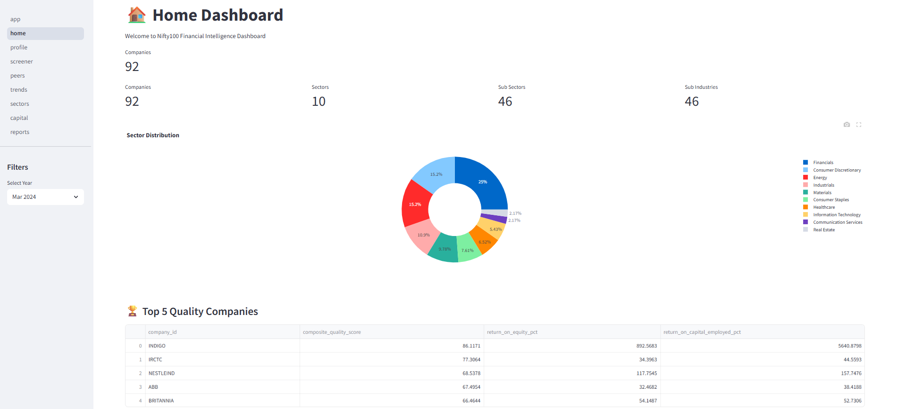
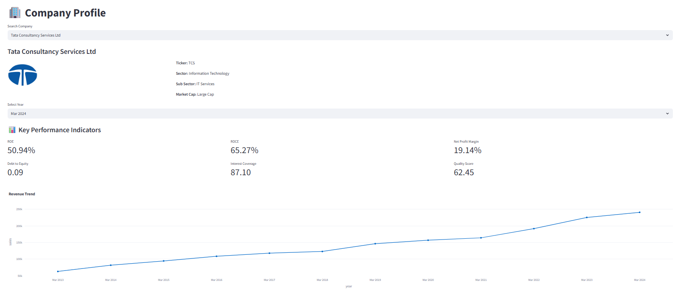
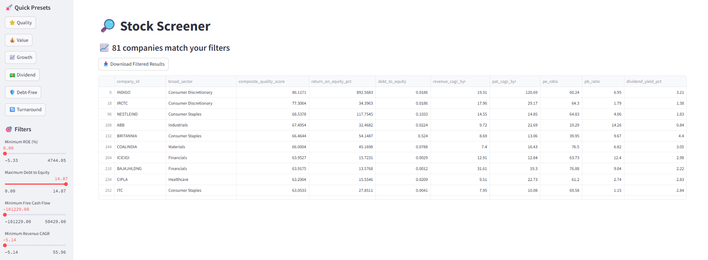
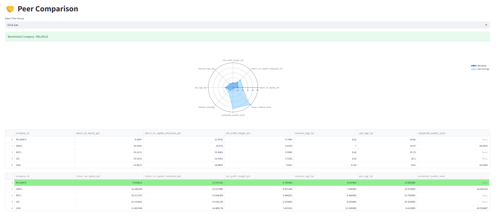
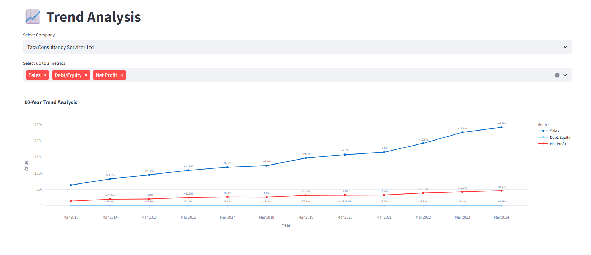
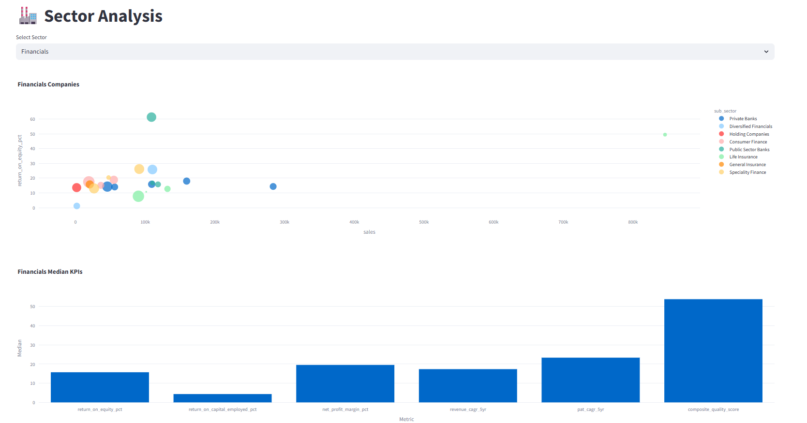
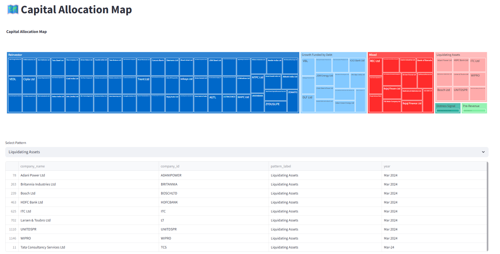
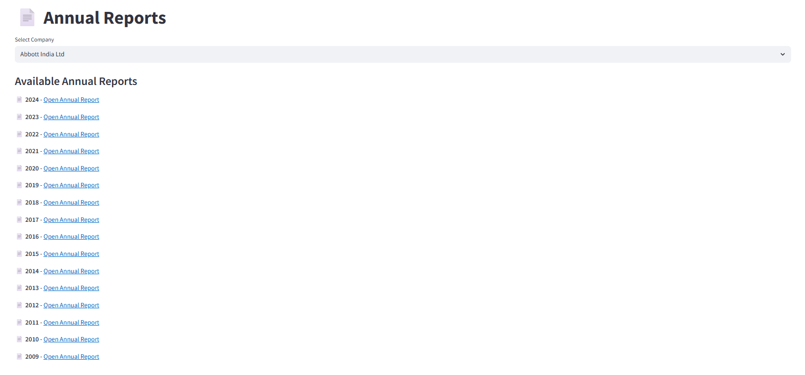

# 📈 Nifty100 Financial Intelligence Dashboard

> A comprehensive Financial Intelligence Platform built using **Python, SQLite, Pandas, Plotly, and Streamlit** to analyze the financial performance of all **92 Nifty 100 companies**.


---

## 📑 Table of Contents

- Project Statistics
- Technology Stack
- Project Overview
- Project Objectives
- Key Features
- Dashboard Preview
- Project Architecture
- Repository Structure
- Dataset Overview
- ETL Pipeline
- Output Reports
- Development Journey
- Dashboard Screens
- Testing
- REST API
- Requirements
- Running the Project
- Project Workflow
- Future Enhancements


---

# 📊 Project Statistics

| Metric | Value |
|---------|------:|
| Companies Analyzed | 92 |
| Excel Datasets | 12 |
| Database Tables | 12 |
| Financial KPIs | 50+ |
| Data Quality Rules | 16 |
| Dashboard Pages | 8 |
| REST API Endpoints | 16 |
| Machine Learning Models | 1 (KMeans) |
| Automated Tests | 100+ |
| Agile Sprints | 6 |

---

# 🛠 Technology Stack

| Category | Technology |
|----------|------------|
| Programming Language | Python 3 |
| Database | SQLite |
| Data Processing | Pandas, NumPy |
| Visualization | Plotly |
| Dashboard | Streamlit |
| REST API | FastAPI |
| Machine Learning | Scikit-learn |
| Reporting | ReportLab |
| Testing | PyTest, pytest-html |
| Deployment | Render |
| Version Control | Git & GitHub |

---

# 📌 Project Overview

The **Nifty100 Financial Intelligence Dashboard** is an end-to-end financial analytics platform that transforms raw financial statements into actionable investment insights for **92 Nifty 100 companies**.

The platform combines **ETL, financial analytics, machine learning, natural language processing, reporting, REST APIs, and interactive dashboards** into a unified system for exploring company fundamentals, screening investment opportunities, benchmarking peers, and generating automated financial reports.

Starting from raw Excel datasets, the project validates and cleans financial data through a robust ETL pipeline, stores the processed information in SQLite, computes 50+ financial KPIs, performs peer and sector analysis, generates PDF reports, exposes REST APIs using FastAPI, and visualizes insights through an interactive Streamlit dashboard.

The application supports financial analysis across **92 Nifty 100 companies** covering multiple sectors including Information Technology, Banking & Financial Services, FMCG, Energy, Healthcare, Automobile, Telecom, Cement, Metals, Chemicals, and Infrastructure.

---

# 🎯 Project Objectives

- Build a complete end-to-end financial intelligence platform using publicly available financial data of **92 Nifty 100 companies**.
- Develop a robust ETL pipeline to extract, validate, normalize, and store financial data in a structured SQLite database.
- Compute **50+ financial KPIs** covering profitability, growth, leverage, efficiency, valuation, and cash flow analytics.
- Build configurable financial screeners with multiple investment strategies and custom filtering capabilities.
- Perform peer-group benchmarking, sector analysis, and percentile-based company comparisons.
- Generate automated Excel reports, PDF company tearsheets, sector reports, and portfolio summary reports.
- Develop an interactive **Streamlit dashboard** for visualizing financial performance and investment insights.
- Implement valuation analytics using market multiples, Free Cash Flow Yield, and sector-relative comparisons.
- Build a production-ready **FastAPI REST API** exposing financial analytics through 16 documented endpoints.
- Apply machine learning techniques for company clustering, correlation analysis, and portfolio-level statistical insights.
- Ensure software quality through comprehensive automated testing, performance validation, and cloud deployment on Render.

---

# ✨ Key Features

## 📂 Data Foundation

- ETL pipeline for loading financial datasets
- Excel data validation and normalization
- SQLite database integration
- Automated data quality checks
- Manual data quality review
- Validation reports and audit logs

---

## 📊 Financial Analytics

The project computes **50+ financial KPIs**, including:

### Profitability

- Net Profit Margin (NPM)
- Operating Profit Margin (OPM)
- Return on Equity (ROE)
- Return on Capital Employed (ROCE)
- Return on Assets (ROA)

### Leverage & Efficiency

- Debt to Equity Ratio
- Interest Coverage Ratio
- Asset Turnover Ratio
- Net Debt

### Growth Metrics

- Revenue CAGR
- PAT CAGR
- EPS CAGR

for:

- 3 Years
- 5 Years
- 10 Years

### Cash Flow Metrics

- Free Cash Flow (FCF)
- CFO Quality Score
- CapEx Intensity
- FCF Conversion Ratio

### Quality Metrics

- Composite Quality Score
- Sector-relative ranking

### Capital Allocation

Classification of companies into capital allocation patterns based on operating, investing, and financing cash flows.

### Valuation

- P/E Ratio
- P/B Ratio
- EV/EBITDA
- FCF Yield
- Sector Median P/E
- Valuation Flags (Fair / Discount / Caution)

---

# 🔍 Financial Screening

The application supports configurable stock screening using multiple financial filters.

Built-in screening presets include:

- ✅ Quality Compounder
- ✅ Value Pick
- ✅ Growth Accelerator
- ✅ Dividend Champion
- ✅ Debt-Free Blue Chip
- ✅ Turnaround Watch

Users can also apply custom threshold filters across multiple financial metrics.

---

# 📊 Peer Group Analysis

The platform performs peer-level benchmarking by:

- Computing percentile rankings
- Comparing companies within peer groups
- Generating radar charts
- Exporting peer comparison reports
- Ranking companies across multiple financial metrics

---

# 🖥 Interactive Dashboard

The Streamlit dashboard provides **8 interactive pages**:

1. Home Dashboard
2. Company Profile
3. Financial Screener
4. Peer Comparison
5. Trend Analysis
6. Sector Analysis
7. Capital Allocation
8. Annual Reports

The dashboard supports:

- Company search
- Interactive Plotly charts
- KPI cards
- Financial tables
- CSV downloads
- Valuation analytics
- Trend visualization

# Dashboard Preview

The Streamlit dashboard consists of eight interactive pages for exploring financial performance, screening companies, benchmarking peers, and generating reports.

| Home | Company Profile |
|------|-----------------|
|  |  |

| Screener | Peer Comparison |
|-----------|-----------------|
|  |  |

| Trend | Sector |
|--------|--------|
|  |  |

| Capital Allocation | Annual Reports |
|--------------------|----------------|
|  |  |

## 🧠 Natural Language Processing (NLP)

- Regex-based financial text parser
- Automatic extraction of CAGR and growth metrics
- Pros & Cons generation using 24 financial rules
- Confidence scoring for generated insights
- Structured NLP outputs for investment analysis

---

## 📄 Financial Reporting

- Company PDF Tearsheets
- Batch Tearsheet Generation
- Sector-wise PDF Reports
- Portfolio Summary Report
- Cash Flow Intelligence Report
- Distress Alert Reports

---

## 🤖 Machine Learning & Statistical Analysis

- KMeans Clustering (5 Financial Archetypes)
- Cluster Profiling
- Correlation Matrix Heatmap
- Outlier Detection using Z-Score
- Portfolio Statistics (P10–P90, Mean, Standard Deviation)

---

## 🌐 REST API

- FastAPI-based REST API
- 16 Production-ready Endpoints
- Company Profile APIs
- Financial Screener APIs
- Sector Analytics APIs
- Peer Comparison APIs
- Portfolio Statistics API
- Market Valuation API
- Annual Report API
- Interactive Swagger Documentation
- ReDoc Documentation
- OpenAPI 3.0 Specification
- Postman Collection

---

## ✅ Testing & Quality Assurance

- ETL Unit Tests
- KPI Formula Tests
- API Endpoint Tests
- Data Validation Tests
- HTML Pytest Report
- Performance Testing
- End-to-End Integration Testing

---

## ☁ Deployment

- Render Cloud Deployment
- Live REST API
- Swagger UI
- ReDoc Documentation


# 🏗 Project Architecture

The project follows a modular architecture where each component is responsible for a specific stage of the financial intelligence pipeline.

```text
                 Raw Excel Files
                        │
                        ▼
           ETL & Data Validation
                        │
                        ▼
                SQLite Database
                        │
        ┌───────────────┼────────────────┬────────────────┐
        │               │                │                │
        ▼               ▼                ▼                ▼
 Financial Analytics  NLP Engine   Reporting Engine   REST API
        │               │                │                │
        ├───────────────┼────────────────┼────────────────┤
        │               │                │                │
        ▼               ▼                ▼                ▼
 Screener Engine   ML Analytics   PDF Reports    API Endpoints
        │               │                │                │
        └───────────────┼────────────────┼────────────────┘
                        ▼
              Streamlit Dashboard
                        │
                        ▼
        Interactive Visualizations & Reports
                        │
                        ▼
             Testing & Cloud Deployment
```

The modular architecture separates data ingestion, analytics, reporting, API services, visualization, and deployment, making the platform scalable, maintainable, and easy to extend.

# 📁 Repository Structure

```
NIFTY100_FINANCIAL_INTELLIGENCE/
│
├── config/
│   └── screener_config.yaml
│
├── data/
│   ├── raw/
│   │   ├── analysis.xlsx
│   │   ├── balancesheet.xlsx
│   │   ├── cashflow.xlsx
│   │   ├── companies.xlsx
│   │   ├── documents.xlsx
│   │   ├── profitandloss.xlsx
│   │   └── prosandcons.xlsx
│   │
│   └── supporting/
│       ├── financial_ratios.xlsx
│       ├── market_cap.xlsx
│       ├── peer_groups.xlsx
│       ├── sectors.xlsx
│       └── stock_prices.xlsx
│
├── db/
│   ├── create_db.py
│   ├── check_db.py
│   ├── check_rows.py
│   └── schema.sql
│
├── docs/
|   ├── acceptance_checklist.pdf
|   ├── analyst_guide.pdf
|   ├── openapi.json
|   ├── postman_collection.json
│   ├── sprint1_retrospective.md
│   ├── sprint2_retrospective.md
│   ├── sprint3_retrospective.md
|   ├── sprint4_retrospective.md
│   └── sprint5_retrospective.md
│
├── notebooks/
│   ├── apply_normalization.py
│   ├── inspect_data.py
│   ├── day6_manual_review_queries.py
│   ├── day6_review_companies.py
│   ├── day14_demo.py
│   ├── day14_screener.py
│   ├── exploratory_queries.sql
│   └── manual_review_notes.md
│
├── output/
|   ├── final_deliverables/
|   ├── analysis_parsed.csv
|   ├── cagr_manual_review.csv
|   ├── capital_allocation_distribution.csv
|   ├── capital_allocation.csv
|   ├── cashflow_intelligence.xlsx
|   ├── cluster_labels.csv
|   ├── compounder_screener.csv
|   ├── distress_alerts.csv
|   ├── dividend_screener.csv
|   ├── generate_validation_report.py
|   ├── growth_screener.csv
|   ├── load_audit.csv
|   ├── outlier_report.csv
|   ├── parse_failures.csv
|   ├── pattern_changes.csv
|   ├── peer_comparison.xlsx
|   ├── portfolio_stats.csv
|   ├── pros_cons_generated.csv
|   ├── quality_screener.csv
|   ├── ratio_edge_cases.log
|   ├── screener_output.xlsx
|   ├── screener.csv
|   ├── skipped_tearsheets.csv
|   ├── turnaround_screener.csv
|   ├── validation_failures.csv
|   ├── valuation_flags.csv
|   ├── valuation_summary.xlsx
|   └──  value_screener.csv
|
├── performance/
|   ├── load_test.py
|   └── perf_notes.md 
│
├── reports/
|   ├── portfolio/
|   ├── radar_charts/
|   ├── sector/
│   ├── tearsheets/
|   ├── correlation_heatmap.png
|   ├── elbow_plot.png
|   └── pytest_report.html
│
├── screenshots/
|
├── src/
│   ├── analytics/
│   │   ├── cagr.py
|   |   ├── capital_allocation_report.py
|   |   ├── cashflow_kpis.py
│   │   ├── cashflow.py
|   |   ├── clustering.py
│   │   ├── composite_score.py
|   |   ├── day13_edge_cases.py
│   │   ├── peer.py
│   │   ├── quality_metrics.py
│   │   ├── ratios.py
|   |   ├── test_quality_metrics.py
│   │   ├── generate_capital_allocation.py
│   │   ├── populate_financial_ratios.py
│   │   └── valuation.py
│   │
│   ├── api/
|   |   ├── database.py
|   |   ├── main.py
│   │   └── routers/
│   │       ├── companies.py
│   │       ├── health.py
|   |       ├── peers.py
|   |       ├── portfolio.py
|   |       ├── screener.py
|   |       ├── sectors.py
|   |       └──  valuation.py
│   │       
│   ├── dashboard/
│   │   ├── app.py
│   │   ├── pages/
│   │   │   ├── 01_home.py
│   │   │   ├── 02_profile.py
│   │   │   ├── 03_screener.py
│   │   │   ├── 04_peers.py
│   │   │   ├── 05_trends.py
│   │   │   ├── 06_sectors.py
│   │   │   ├── 07_capital.py
│   │   │   └── 08_reports.py
│   │   └── utils/
│   │       └── db.py
│   │
│   ├── etl/
│   │   ├── loader.py
│   │   ├── normalizer.py
│   │   ├── validator.py
│   │   ├── db_loader.py
│   │   └── explore_data.py
│   │
│   ├── nlp/
|   |   ├── parser.py
|   |   └── pros_cons_generator.py 
│   │
│   ├── reporting/
|   |   ├── batch_tearsheets.py
│   │   ├── export_excel.py
│   │   ├── peer_comparison_excel.py
|   |   ├── portfolio_summary.py
│   │   ├── radar_charts.py
|   |   ├── sector_report.py
|   |   └── tearsheet.py 
│   │
│   └── screener/
│       ├── engine.py
│       └── presets.py
│
├── tests/
|   ├── api/
|   |   ├── test_companies.py
|   |   ├── test_health.py
|   |   ├── test_screener.py
|   |   └── test_sectors.py
|   |
│   ├── etl/
│   │   ├── test_loader.py
│   │   ├── test_normalizer.py
│   │   └── test_validator.py
│   │
│   └── kpi/
│       ├── test_ratios.py
│       ├── test_cashflow.py
│       └── test_cagr.py
|
├── nifty100.db
├── render.yaml
├── Procfile
├── README.md
|
├── .env
├── .gitignore
└──  requirements.txt

```

---

# 📊 Dataset Overview

The project uses **12 Excel datasets** as the primary source of financial information.

## Raw Datasets

| Dataset | Description |
|---------|-------------|
| companies.xlsx | Company master information |
| analysis.xlsx | Business overview |
| balancesheet.xlsx | Balance Sheet |
| cashflow.xlsx | Cash Flow Statement |
| profitandloss.xlsx | Profit & Loss Statement |
| prosandcons.xlsx | Company strengths and weaknesses |
| documents.xlsx | Annual report links |

## Supporting Datasets

| Dataset | Description |
|---------|-------------|
| financial_ratios.xlsx | Computed KPI storage |
| market_cap.xlsx | Market valuation metrics |
| peer_groups.xlsx | Industry peer mapping |
| sectors.xlsx | Sector classification |
| stock_prices.xlsx | Historical stock prices |

---

# 🗄 SQLite Database

All processed data is stored inside:

```
nifty100.db
```

The database is generated during the ETL process and serves as the central data source for analytics and dashboard modules.

### Major Tables

- companies
- balancesheet
- cashflow
- profitandloss
- financial_ratios
- analysis
- documents
- prosandcons
- sectors
- market_cap
- peer_groups
- stock_prices

---

# 🔄 ETL Pipeline

The project follows a structured ETL workflow.

## Step 1 — Extract

- Read Excel files
- Load all datasets into Pandas DataFrames

## Step 2 — Transform

- Normalize years
- Normalize company tickers
- Validate schema
- Handle missing values
- Apply data quality rules
- Validate primary and foreign keys

## Step 3 — Load

- Create SQLite schema
- Insert validated data
- Generate audit reports
- Populate supporting tables

---

# ✔ Data Quality Validation

The ETL pipeline validates data before loading it into SQLite.

Validation includes:

- Schema validation
- Primary Key validation
- Foreign Key validation
- Duplicate detection
- Missing value checks
- Financial consistency checks
- Manual review for edge cases

Generated reports include:

- `load_audit.csv`
- `validation_failures.csv`
- `ratio_edge_cases.log`

---

# ⚙ Configuration

The financial screener is fully configurable using:

```
config/screener_config.yaml
```

This configuration file defines:

- Metric thresholds
- Preset screeners
- Filter limits
- Default values

The screening engine automatically reads these settings without requiring code changes.

---

# 📈 Output Reports

The platform automatically generates analytical reports, dashboards, PDFs, CSV exports, and API documentation throughout the ETL, analytics, reporting, and testing pipeline.

---

## 📊 Financial Reports

| Output | Description |
|---------|-------------|
| `screener_output.xlsx` | Complete financial screener results |
| `peer_comparison.xlsx` | Peer comparison workbook |
| `valuation_summary.xlsx` | Company valuation metrics |
| `cashflow_intelligence.xlsx` | Cash flow intelligence analysis |
| `portfolio_summary.pdf` | Portfolio summary report |
| `tearsheets/` | Individual 2-page company PDF tearsheets |
| `sector/` | Sector-wise PDF reports |

---

## 📈 Analytics Outputs

| Output | Description |
|---------|-------------|
| `capital_allocation.csv` | Capital allocation classification |
| `analysis_parsed.csv` | NLP parsed CAGR values |
| `pros_cons_generated.csv` | Auto-generated company pros & cons |
| `cluster_labels.csv` | KMeans cluster assignments |
| `portfolio_stats.csv` | Portfolio percentile statistics |
| `outlier_report.csv` | Z-score based outlier detection |
| `pattern_changes.csv` | Capital allocation pattern changes |
| `distress_alerts.csv` | Companies with distress signals |

---

## 🧪 Data Quality & Validation

| Output | Description |
|---------|-------------|
| `load_audit.csv` | ETL loading summary |
| `validation_failures.csv` | Data quality validation report |
| `parse_failures.csv` | NLP parsing failures |
| `ratio_edge_cases.log` | KPI edge-case log |
| `skipped_tearsheets.csv` | Companies skipped during PDF generation |

---

## 📉 Visual Reports

| Output | Description |
|---------|-------------|
| `correlation_heatmap.png` | Pearson correlation heatmap |
| `elbow_plot.png` | KMeans elbow curve |
| `radar_charts/` | Peer comparison radar charts |

---

## 🌐 API & Testing

| Output | Description |
|---------|-------------|
| `openapi.json` | OpenAPI 3.0 specification |
| `postman_collection.json` | Postman API collection |
| `pytest_report.html` | HTML test execution report |
| `perf_notes.md` | Performance testing summary |

---

## 📄 Documentation

| Output | Description |
|---------|-------------|
| `README.md` | Project documentation |
| `analyst_guide.pdf` | User & analyst guide |
| `acceptance_checklist.pdf` | Final project acceptance checklist |

---

## 🖥 Dashboard Outputs

The interactive Streamlit dashboard provides rich visualizations and downloadable insights for financial analysis.

- Interactive Plotly charts
- KPI summary cards
- Radar charts
- Correlation heatmaps
- Company trend visualizations
- Sector comparison charts
- CSV downloads
- Company insights
- Peer benchmarking dashboards
- Capital allocation visualizations

# 🚀 Development Journey

The project was developed over **6 Agile Sprints**, with each sprint focusing on a major milestone in building the Financial Intelligence Platform.

---

# 🟢 Sprint 1 – Data Foundation

**Goal:** Build a reliable data pipeline capable of loading, validating, and storing financial data for all Nifty 100 companies.

### Completed Tasks

- Environment setup and project initialization
- Excel data loader implementation
- Data normalization
  - Year normalization
  - Company ticker normalization
- Schema validation
- 16 Data Quality (DQ) validation rules
- SQLite database schema creation
- ETL pipeline implementation
- Loading all 12 Excel datasets
- Audit report generation
- Manual data quality review
- Exploratory SQL queries

### Key Deliverables

- SQLite database (`nifty100.db`)
- ETL pipeline
- Data validation engine
- Database schema
- Load audit report
- Validation failure report

---

# 🟡 Sprint 2 – Financial Ratio Engine

**Goal:** Compute financial KPIs for every company across all available financial years.

### Profitability Metrics

- Net Profit Margin
- Operating Profit Margin
- Return on Equity (ROE)
- Return on Capital Employed (ROCE)
- Return on Assets (ROA)

### Leverage & Efficiency

- Debt-to-Equity Ratio
- Interest Coverage Ratio
- Asset Turnover
- Net Debt

### Growth Analytics

- Revenue CAGR
- PAT CAGR
- EPS CAGR

for:

- 3-Year
- 5-Year
- 10-Year periods

### Cash Flow Analytics

- Free Cash Flow
- CFO Quality Score
- CapEx Intensity
- FCF Conversion Ratio

### Capital Allocation

Implemented an 8-pattern capital allocation classification based on operating, investing, and financing cash flows.

### Additional Work

- Populated the `financial_ratios` table
- Edge-case handling
- Financial sector-specific ROCE logic
- Formula validation
- Unit testing
- Manual KPI verification

### Key Deliverables

- Financial Ratio Engine
- CAGR Engine
- Cash Flow KPI Engine
- Capital Allocation Engine
- Quality Metrics
- Ratio edge-case logging

---

# 🔵 Sprint 3 – Screener & Peer Analytics

**Goal:** Build a configurable stock screening engine and peer comparison system.

### Financial Screener

Implemented a configurable screening engine supporting custom financial filters.

Supported metrics include:

- ROE
- D/E
- Revenue CAGR
- PAT CAGR
- Free Cash Flow
- Dividend Yield
- Interest Coverage
- Asset Turnover
- Market Capitalization
- Earnings Growth
- Profitability Metrics

### Preset Screeners

Developed six predefined investment strategies:

- Quality Compounder
- Value Pick
- Growth Accelerator
- Dividend Champion
- Debt-Free Blue Chip
- Turnaround Watch

### Composite Quality Score

Built a weighted quality score using:

- Profitability
- Cash Quality
- Growth
- Leverage

### Peer Analytics

Implemented:

- Peer percentile rankings
- Peer benchmarking
- Radar charts
- Peer comparison reports

### Reporting

Generated:

- Screener reports
- Peer comparison Excel reports
- Radar chart visualizations

### Key Deliverables

- Screening Engine
- Composite Scoring Engine
- Peer Ranking Engine
- Radar Charts
- Excel Reporting

---

# 🔴 Sprint 4 – Dashboard & Valuation

**Goal:** Build an interactive Streamlit dashboard and valuation module.

### Interactive Dashboard

Developed an 8-page Streamlit application featuring:

- Home Dashboard
- Company Profile
- Financial Screener
- Peer Comparison
- Trend Analysis
- Sector Analysis
- Capital Allocation
- Annual Reports

### Dashboard Features

- Interactive company search
- KPI cards
- Plotly visualizations
- Multi-year trend analysis
- Peer benchmarking
- Sector comparison
- CSV downloads
- Responsive layout

### Valuation Module

Implemented valuation analytics including:

- Free Cash Flow Yield
- Sector Median P/E
- 5-Year Median P/E
- P/E vs Sector Median
- Valuation Flags
  - Fair
  - Discount
  - Caution

### Quality Assurance

Performed:

- Multi-company dashboard testing
- Partial-data validation
- Missing-data handling
- Screener stress testing
- Chart layout fixes
- Performance testing
- Bug fixes

### Key Deliverables

- Streamlit Dashboard
- Valuation Engine
- Valuation Reports
- Dashboard Utilities
- Integration Testing
- Project Documentation

---

# 🟣 Sprint 5 – Intelligence & Reporting

**Goal:** Enhance the platform with Natural Language Processing (NLP), advanced financial intelligence, automated PDF reporting, and portfolio-level analytics.

### Natural Language Processing (NLP)

Implemented an NLP module capable of extracting structured financial information from textual analysis.

Features include:

- Regex-based financial text parsing
- CAGR extraction from business analysis
- Structured analysis output generation
- Parse failure logging
- Manual review support

### Pros & Cons Generator

Developed a rule-based financial intelligence engine using:

- 12 Pro rules
- 12 Con rules
- Confidence scoring
- Automatic company insight generation

### Cash Flow Intelligence

Implemented advanced cash flow analytics including:

- CFO Quality Score
- CapEx Intensity
- Distress Signal Detection
- Deleveraging Detection
- Capital Allocation Classification

### Financial Reporting

Generated professional reports including:

- Company PDF Tearsheets
- Sector Reports
- Portfolio Summary Report
- Cash Flow Intelligence Report
- Distress Alert Report

### Key Deliverables

- NLP Parser
- Pros & Cons Generator
- Cash Flow Intelligence Engine
- PDF Reporting System
- Portfolio Summary
- Sector Reports

---

# 🟠 Sprint 6 – API, Clustering & Quality Assurance

**Goal:** Build a production-ready REST API, perform machine learning analysis, implement automated testing, and complete project documentation.

### Machine Learning

Implemented KMeans clustering using financial KPIs.

Features include:

- Five financial archetype clusters
- Cluster profiling
- Correlation heatmap
- Outlier detection
- Portfolio statistics

### REST API

Developed a FastAPI backend providing:

- 16 REST API endpoints
- Company APIs
- Screener APIs
- Sector APIs
- Peer Comparison APIs
- Portfolio Statistics API
- Market Valuation API
- Health Endpoint
- OpenAPI 3.0 Documentation
- ReDoc Documentation
- Postman Collection

### Testing & Quality Assurance

Implemented comprehensive automated testing covering:

- ETL Tests
- KPI Formula Tests
- API Endpoint Tests
- Data Validation Tests
- Performance Testing
- Integration Testing

Generated:

- HTML Pytest Report
- Performance Notes
- Acceptance Checklist

### Deployment

Successfully deployed the FastAPI application on Render.

Deployment includes:

- Live REST API
- Swagger UI
- ReDoc Documentation
- Production-ready OpenAPI Specification

### Key Deliverables

- FastAPI Server
- REST API (16 Endpoints)
- KMeans Clustering Module
- Automated Test Suite
- HTML Test Report
- Analyst Guide
- Acceptance Checklist
- Production Deployment

---

# 🏆 Project Highlights

Across **six Agile sprints**, the project evolved into a complete Financial Intelligence Platform covering data engineering, financial analytics, business intelligence, machine learning, reporting, REST API development, testing, and deployment.

### Major Achievements

- ETL pipeline for ingesting and validating 12 financial datasets
- SQLite database with normalized and validated financial data
- 50+ financial KPIs across profitability, growth, leverage, efficiency, valuation, and cash flow
- Configurable financial screening engine with multiple investment presets
- Composite Quality Score and peer percentile ranking
- Sector analysis and valuation analytics
- NLP-based financial text parser
- Automatic Pros & Cons generation using financial rule engine
- Cash Flow Intelligence and Capital Allocation analytics
- Professional PDF Company Tearsheets
- Sector Reports and Portfolio Summary Report
- KMeans clustering with five financial archetypes
- Correlation heatmap and statistical portfolio analysis
- Outlier detection using Z-score analysis
- FastAPI-powered REST API with 16 production-ready endpoints
- Interactive Swagger UI, ReDoc documentation, and OpenAPI specification
- Automated ETL, KPI, Validation, and API test suites (100+ tests)
- HTML Pytest report and performance testing
- Production deployment on Render Cloud

The completed platform provides an end-to-end workflow—from raw financial statements to validated analytics, interactive dashboards, machine learning insights, automated reports, and a cloud-hosted REST API for exploring financial intelligence across all **92 Nifty 100 companies**.

# 🖥 Dashboard Screens

The project includes an interactive **8-page Streamlit dashboard** for exploring financial data, screening companies, and visualizing key business metrics.

---

## 🏠 1. Home Dashboard

**Purpose**

Provides an overview of the entire Nifty 100 universe.

### Features

- Summary KPI cards
- Sector distribution
- Top-performing companies
- Year selection
- Interactive navigation

---

## 🏢 2. Company Profile

Displays a detailed financial profile for an individual company.

### Features

- Company information
- Sector & Sub-sector
- Financial KPIs
- Revenue & Net Profit charts
- ROE & ROCE trends
- Pros & Cons
- Company search

---

## 🔍 3. Financial Screener

Filter companies using customizable financial metrics.

### Features

- 10 interactive sliders
- 6 preset screeners
- Live filtering
- CSV download
- Composite quality score

Supported presets:

- Quality
- Value
- Growth
- Dividend
- Debt-Free
- Turnaround

---

## 🤝 4. Peer Comparison

Compare companies within the same peer group.

### Features

- Peer group selector
- Radar chart
- KPI comparison
- Peer benchmarking
- Side-by-side metrics

---

## 📈 5. Trend Analysis

Analyze long-term financial performance.

### Features

- Company search
- Multi-metric selection
- 10-year trend visualization
- YoY growth annotations
- Interactive Plotly charts

---

## 🏭 6. Sector Analysis

Compare companies across industry sectors.

### Features

- Sector filter
- Bubble chart
- Market capitalization visualization
- Sector median KPI comparison

---

## 🌳 7. Capital Allocation

Visualize how companies allocate capital.

### Features

- Treemap visualization
- Capital allocation patterns
- Company grouping
- Pattern-wise comparison

---

## 📄 8. Annual Reports

Displays all available annual reports for the selected company with direct links to BSE PDFs.

### Features

- Company search
- Available report years
- Clickable PDF links
- BSE integration


---


# 🧪 Testing & Quality Assurance

A comprehensive automated testing framework was implemented to verify the correctness, reliability, and performance of the Financial Intelligence Platform.

## Test Categories

### ETL Tests

Validates the data ingestion pipeline by verifying:

- Year normalization
- Data loading
- Schema validation
- Column validation
- Row counts
- Data Quality rules

### KPI Tests

Verifies the correctness of financial calculations including:

- Profitability ratios
- Leverage ratios
- Efficiency ratios
- CAGR calculations
- Cash Flow metrics
- Edge-case handling

### API Tests

Automated tests validate the FastAPI endpoints including:

- Health endpoint
- Company endpoints
- Screener endpoints
- Sector endpoints
- HTTP status codes
- Invalid request handling

### Performance & Integration Tests

The project includes:

- Concurrent API load testing
- Dashboard performance verification
- End-to-end integration testing
- SQLite query optimization

---

## Test Reports

Generate the complete HTML report using:

```bash
pytest tests/ --html=reports/pytest_report.html
```

The report contains:

- Test execution summary
- Passed / Failed statistics
- Execution time
- Individual test results

---

## Overall Test Coverage

The project contains **100+ automated tests** covering:

- ETL Pipeline
- KPI Engine
- Data Validation
- REST API
- Integration Testing

All tests passed successfully before the final project submission.
---

# 🌐 REST API

The project includes a production-ready REST API built using **FastAPI**, enabling programmatic access to financial data, screening, analytics, and reports.

## Features

- RESTful API architecture
- 16 production-ready endpoints
- Interactive Swagger UI
- ReDoc API documentation
- OpenAPI 3.0 Specification
- Postman Collection
- JSON responses
- SQLite backend integration

---

## API Modules

### Health

- Service health monitoring
- Database table statistics
- API version information
- Server uptime

### Companies

- Company listing
- Company profile
- Profit & Loss history
- Balance Sheet history
- Cash Flow history
- Financial Ratios
- Company Tearsheet

### Financial Screener

Supports filtering companies using:

- ROE
- Debt-to-Equity
- Free Cash Flow
- Revenue CAGR
- PAT CAGR
- P/E Ratio
- Sector filters

### Sector Analytics

- Sector summary
- Sector-wise companies
- Median financial metrics

### Peer Analytics

- Peer comparison
- Percentile rankings
- Radar chart data

### Valuation

- Historical valuation multiples
- Market capitalization metrics

### Portfolio Analytics

- Portfolio percentile statistics

### Documents

- Annual report links
- URL validation status

---

## API Documentation

### Swagger UI

```
http://127.0.0.1:8000/docs
```

### ReDoc

```
http://127.0.0.1:8000/redoc
```

---

## Live Deployment

The REST API is deployed on **Render**.

**Base URL**

```
https://prashanth-nifty100-financial-intelligence.onrender.com
```

**Swagger UI**

```
https://prashanth-nifty100-financial-intelligence.onrender.com/docs
```

**ReDoc**

```
https://prashanth-nifty100-financial-intelligence.onrender.com/redoc
```

---

## Sample API Request

```bash
curl https://prashanth-nifty100-financial-intelligence.onrender.com/api/v1/companies/TCS
```

The API returns JSON responses and can be integrated with dashboards, web applications, mobile apps, or external analytics platforms.

{
  "ticker": "TCS",
  "company_name": "Tata Consultancy Services",
  "sector": "Information Technology",
  "roe": 52.4,
  "roce": 63.1
}

---

# ⚙ Requirements

### Software Requirements

- Python 3.10+
- SQLite 3
- Git

### Python Libraries

- FastAPI
- Uvicorn
- Streamlit
- Pandas
- NumPy
- Plotly
- scikit-learn
- SQLAlchemy
- ReportLab
- OpenPyXL
- PyTest
- pytest-html
- HTTPX
- Requests
- PyYAML

Install all project dependencies using:

```bash
pip install -r requirements.txt
```

---

# ▶️ Running the Project

## 1. Clone the Repository

```bash
git clone https://github.com/Gnana-Prashanth/nifty100-financial-intelligence
cd NIFTY100_FINANCIAL_INTELLIGENCE
```

---

## 2. Install Dependencies

```bash
pip install -r requirements.txt
```

---

## 3. Run the ETL Pipeline

```bash
python src/etl/db_loader.py
```

This loads, validates, and stores all datasets into the SQLite database.

---

## 4. Launch the Streamlit Dashboard

```bash
streamlit run src/dashboard/app.py
```

Open:

```
http://localhost:8501
```

---

## 5. Launch the FastAPI Server

```bash
uvicorn src.api.main:app --reload
```

API available at:

```
http://127.0.0.1:8000
```

Swagger UI:

```
http://127.0.0.1:8000/docs
```

ReDoc:

```
http://127.0.0.1:8000/redoc
```

---

## 6. Run the Test Suite

Execute all automated tests:

```bash
pytest tests/
```

Generate the HTML report:

```bash
pytest tests/ --html=reports/pytest_report.html
```

---

## 7. Live Deployment

The REST API is deployed on Render.

**Base URL**

```
https://prashanth-nifty100-financial-intelligence.onrender.com
```

**Swagger UI**

```
https://prashanth-nifty100-financial-intelligence.onrender.com/docs
```

**ReDoc**

```
https://prashanth-nifty100-financial-intelligence.onrender.com/redoc
```

---

# 🔄 Project Workflow

```text
                 Raw Excel Files
                        │
                        ▼
           ETL & Data Validation Pipeline
                        │
                        ▼
                SQLite Database
                        │
        ┌───────────────┼────────────────┐
        │               │                │
        ▼               ▼                ▼
 Financial Analytics   NLP Engine    Reporting Engine
        │               │                │
        ├───────────────┼────────────────┤
        │               │                │
        ▼               ▼                ▼
 Screening Engine  ML Analytics    PDF Reports
        │               │                │
        ├───────────────┼────────────────┤
        │               │                │
        ▼               ▼                ▼
 Streamlit Dashboard  FastAPI REST API  Automated Tests
        │               │                │
        └───────────────┼────────────────┘
                        ▼
              Render Cloud Deployment
```

# 🚀 Future Enhancements

- User authentication
- Portfolio tracking
- Real-time stock prices
- AI-powered financial summaries
- Cloud database migration
- Docker containerization